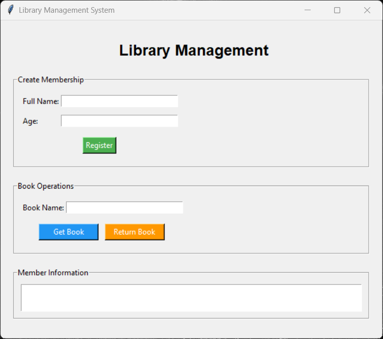
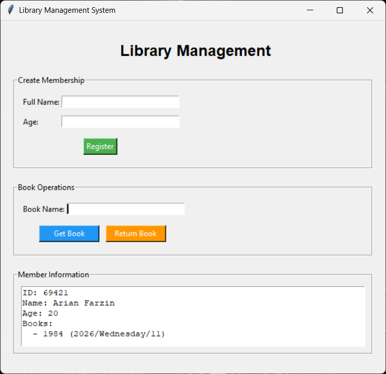

# Library Management System 📚

A simple library management system built with Python using OOP concepts and Tkinter GUI.

## Features

- Create library membership
- Borrow up to 3 books
- Return borrowed books
- Age validation
- Simple graphical interface (Tkinter)

## Technologies

- Python 3
- Tkinter

## How to Run

`bash
git clone https://github.com/ArianFarzin/Library-management-system.git
cd Library-management-system
python library_gui.py

## Screenshots

## Author

Arian Farzin
